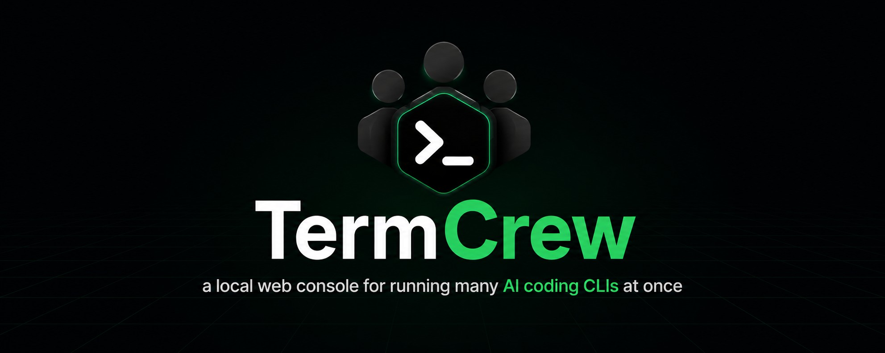
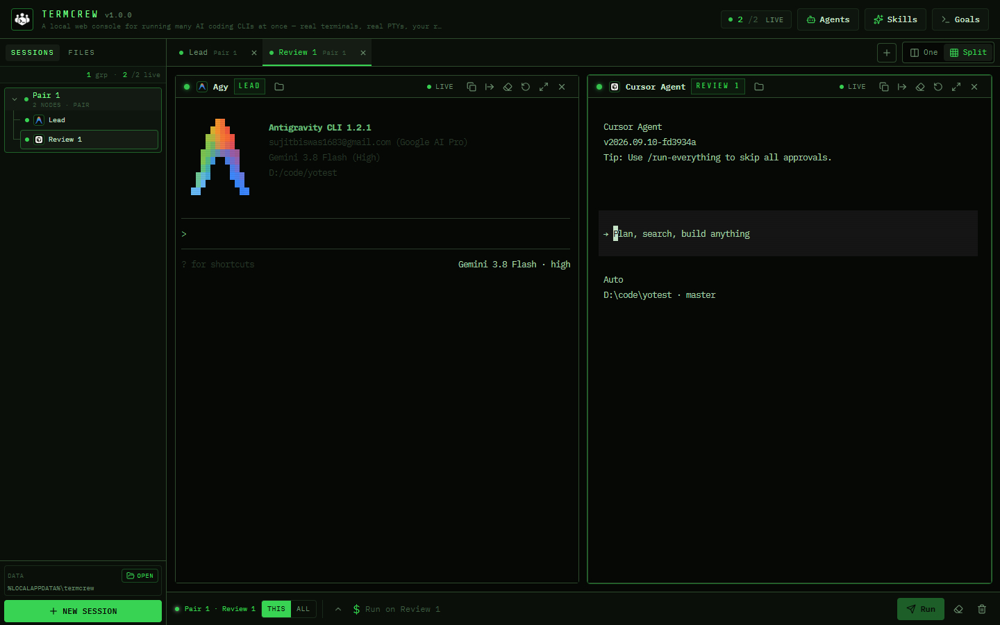
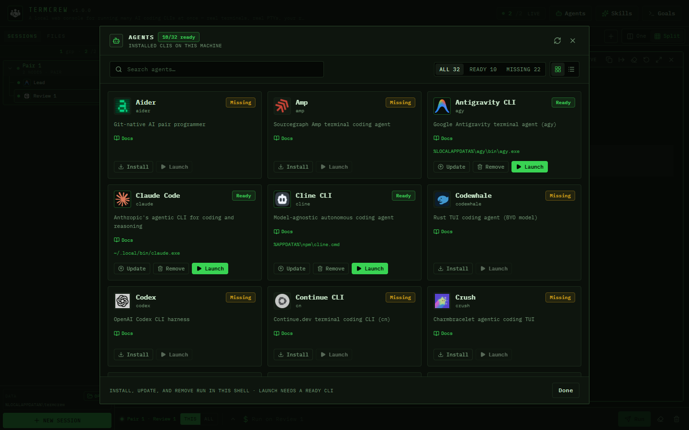

<div align="center">



# TermCrew


[](https://github.com/SSujitX/TermCrew/releases)

</div>

**TermCrew** is a local web console for running many AI coding CLIs at once — real terminals, real PTYs, your repo, your machine.

It is a **multi-agent terminal**: one browser window, a grid of live panes, and layouts for solo work, pair review, a workbench with a shell, or a swarm of isolated workers. Claude Code, Codex, Gemini CLI, Cursor Agent, and 24 other coding CLIs sit next to PowerShell, zsh, Git Bash, or WSL.

No cloud control plane. The API binds `127.0.0.1:3001`. The UI is `http://localhost:5173`.

**[Install →](#install)**

<div align="center">



<p><em>Pair layout: lead and reviewer in real PTYs, same folder, one window.</em></p>



<p><em>Agents panel: detect what’s installed, then install, update, or remove with each vendor’s official command.</em></p>

</div>

---

## What is TermCrew?

TermCrew is local-first software that launches official AI coding agents in native pseudo-terminals and shows them side by side. You pick a folder, a layout, and the CLIs already on your PATH. TermCrew does not replace those CLIs, host your code, or run a planner model of its own.

Use it when one chat window is not enough: a lead agent writes, a reviewer reads the diff, a shell runs tests, and extra workers stay in git worktrees outside the project.

---

## Why a multi-agent terminal (not more windows)

Opening six terminals works until you need a shared folder, a review packet, or a test command that must not land in an agent chat box.


| Approach                        | What you get                   | What TermCrew adds                                           |
| ------------------------------- | ------------------------------ | ------------------------------------------------------------ |
| Extra OS terminals              | Separate windows, no shared UI | One grid, One/Split, add a pane without killing the others   |
| tmux / Zellij / iTerm splits    | Great multiplexers for shells  | Agent catalog, install/update from the UI, Pair/Swarm roles  |
| VS Code / Cursor terminal panel | Integrated but one product     | Mix Claude, Codex, Gemini, Cursor Agent, Grok, … in one crew |
| Cloud multi-agent dashboards    | Remote orchestration           | Loopback only; keys and repos stay on your machine           |


TermCrew is closer to a **crew console** than a multiplexer: presets assign roles, Goals types a different contract per role, and Swarm workers get isolated worktrees under app data (your repo is not polluted with `.worktrees`).

---

## Features


| Capability         | What it does                                                                                                                       |
| ------------------ | ---------------------------------------------------------------------------------------------------------------------------------- |
| **Multi-CLI grid** | Live xterm.js panes over ConPTY (Windows) or Unix PTYs. **+** adds a pane to the current group; existing sockets stay up.          |
| **Presets**        | **Solo** · **Pair** (lead + reviewers, same folder) · **Workbench** (agents + a shell) · **Swarm** (workers in isolated worktrees) |
| **Agent registry** | Detect, **install**, **update**, and **remove** CLIs from the Agents panel using each vendor’s documented command (hidden setup PTY) |
| **Skills**         | Browse global + project + system skill roots; show/hide, copy, delete; install from disk, git, or [skills.sh](https://skills.sh)     |
| **Goals playbook** | One goal → role-specific prompts (build / review / shell). Not a TermCrew-owned planner LLM                                          |
| **Send review**    | Compact git packet (role, folder, status, diff) — no chat transcript — so the reviewer is cheap on tokens                          |
| **Broadcast**      | Type once into many panes; each still has its own native colors and prompt                                                         |
| **Files**          | Tree + Monaco tabs on the session strip. Opening a file does not remount live agents                                               |
| **Park / restart** | Backend restart parks sessions and keeps scrollback; Restart relaunches the same id and worktree. Kill deletes both                |


---

## Manage agents (install / update / remove)

Open **Agents** in the header. TermCrew scans PATH and known vendor folders (WinGet, npm, `~/.local/bin`, …) and shows which of the 28 CLIs are on the machine.

| Action | What happens |
| --- | --- |
| **Install** | Runs that CLI’s official install command in a hidden setup console. When it finishes, the catalog rescans. |
| **Update** | Same console, vendor update command. |
| **Remove** | Stops live panes of that engine, runs the official uninstall, then clears leftover shims/dirs if the vendor left them. Codex remove is the **CLI only**, not the ChatGPT desktop app. |
| **Launch** | Opens the session launcher with that agent preselected (installed agents only). |

One install/update/remove at a time — other lifecycle buttons stay disabled until it finishes. Agents the current OS cannot install (for example Plandex on Windows) show a docs hint instead of a live Install button. Shells are detected, not “installed” by TermCrew.

Commands are taken from each product’s docs, not invented scripts.

---

## Supported AI coding agents

TermCrew auto-detects these **28** CLIs (plus system shells). Install from the Agents panel or the vendor docs; TermCrew does not bundle the models.


| Agent                                                                                     | Binary        | Notes                                                                  |
| ----------------------------------------------------------------------------------------- | ------------- | ---------------------------------------------------------------------- |
| [Claude Code](https://code.claude.com/docs/en/overview)                                   | `claude`      | Anthropic agentic CLI                                                  |
| [Codex](https://developers.openai.com/codex/cli)                                          | `codex`       | OpenAI Codex CLI (uninstall removes the CLI only, not the ChatGPT app) |
| [Gemini CLI](https://github.com/google-gemini/gemini-cli)                                 | `gemini`      | Google Gemini coding CLI                                               |
| [Antigravity CLI](https://antigravity.google/docs/cli/install/)                           | `agy`         | Google Antigravity (`agy`)                                             |
| [Cursor Agent](https://cursor.com/docs/cli/overview)                                      | `agent`       | Official Cursor CLI                                                    |
| [Amp](https://ampcode.com/manual)                                                         | `amp`         | Sourcegraph Amp                                                        |
| [Grok Build](https://docs.x.ai/docs)                                                      | `grok`        | xAI Grok coding TUI                                                    |
| [Kiro](https://kiro.dev/docs/cli)                                                         | `kiro-cli`    | AWS Kiro (replaces the old Amazon Q CLI in this catalog)               |
| [OpenCode](https://opencode.ai/docs)                                                      | `opencode`    | Terminal-native coding agent                                           |
| [OpenClaw](https://docs.openclaw.ai)                                                      | `openclaw`    | Local assistant CLI                                                    |
| [Pi](https://github.com/badlogic/pi-mono)                                                 | `pi`          | Minimal terminal harness                                               |
| [Hermes Agent](https://hermes-agent.nousresearch.com/docs/getting-started/installation)   | `hermes`      | Nous Research CLI                                                      |
| [Aider](https://aider.chat/docs/install.html)                                             | `aider`       | Git-native pair programmer                                             |
| [Goose](https://block.github.io/goose/docs/getting-started/installation)                  | `goose`       | On-device agent (Block / LF)                                           |
| [Cline CLI](https://docs.cline.bot/cline-cli/installation)                                | `cline`       | Model-agnostic agent                                                   |
| [Crush](https://github.com/charmbracelet/crush)                                           | `crush`       | Charmbracelet agentic TUI                                              |
| [Qwen Code](https://qwenlm.github.io/qwen-code-docs/en/users/quickstart/)                 | `qwen`        | Alibaba Qwen CLI                                                       |
| [Kimi Code](https://www.kimi.com/code/docs/en/kimi-code-cli/guides/getting-started.html)  | `kimi`        | Moonshot Kimi Code CLI                                                 |
| [Plandex](https://docs.plandex.ai/install)                                                | `plandex`     | Plan-first multi-file agent                                            |
| [OpenHands](https://docs.openhands.dev/openhands/usage/cli/installation)                  | `openhands`   | OpenHands developer CLI                                                |
| [Open Interpreter](https://docs.openinterpreter.com)                                      | `interpreter` | Local code-executing agent                                             |
| [Continue CLI](https://docs.continue.dev/cli/quickstart)                                  | `cn`          | Continue.dev terminal CLI                                              |
| [Kilo Code](https://kilo.ai/docs/code-with-ai/platforms/cli)                              | `kilo`        | Kilo agentic CLI                                                       |
| [Mistral Vibe](https://docs.mistral.ai/getting-started/quickstarts/vibe-code/install-cli) | `vibe`        | Mistral coding assistant                                               |
| [ForgeCode](https://forgecode.dev/docs)                                                   | `forge`       | Multi-model pair programmer                                            |
| [gptme](https://gptme.org/docs/getting-started.html)                                      | `gptme`       | Persistent terminal agent                                              |
| [Codewhale](https://github.com/Hmbown/CodeWhale)                                          | `codewhale`   | Rust TUI, bring your own model                                         |
| [DeepSeek Harness](https://deepseek-harness.github.io/deepseek-harness/)                  | `dsh`         | DeepSeek agent harness                                                 |


**Shells** (always first-class panes, not fake agents):

- **Windows:** PowerShell, Command Prompt, Git Bash, WSL
- **macOS:** zsh (default), bash, sh

Roo Code and Zoo Code are **not** in the catalog (Roo’s GitHub is archived; Zoo was removed).

---

## Skills (global, project, marketplace)

Open **Skills** in the header. TermCrew lists every folder that contains a `SKILL.md` across harness roots — it does not invent a skill format of its own.

| Scope | Where | Editable |
| --- | --- | --- |
| **Global / user** | `~/.agents/skills`, `~/.claude/skills`, `~/.codex/skills`, `~/.cursor/skills`, OpenCode, OpenClaw, Hermes, Gemini, Kiro, Goose | Yes |
| **Project** | `{repo}/.claude/skills`, `.agents/skills`, `.cursor/skills`, `.codex/skills` | Yes |
| **System** | `~/.codex/skills/.system`, `~/.agents/skills/.system` (and similar reserved folders) | **Read-only** — preview and open only |

Per skill:

- **Show / Hide** — TermCrew list preference only (`skills-prefs.json`). Does not delete the files or change the harness.
- **Preview** — `SKILL.md` (capped).
- **Copy** — into another writable root (another harness or project).
- **Open** — Explorer / Finder on that skill folder.
- **Delete** — three-step confirm; TermCrew will not delete system / reserved folders.

**Install more**

- **Local** — pick a folder that already has `SKILL.md`.
- **Git** — clone a repo URL into a writable root (hooks disabled).
- **Marketplace** — browse [skills.sh](https://skills.sh) (Hot / Trending / Most viewed, search). Install runs `npx skills add … --copy` for a chosen harness; tick **global** (`-g`) to write the user root instead of the project. Same hidden setup console as agent install.

---

## Goals playbook

Goals is a **role playbook**, not a supervisor LLM and not a fake Plan → Build → Review → Verify machine.

1. Focus a session group and open **Goals**.
2. Write the outcome in plain language.
3. **Run playbook** types a *different* contract into each live pane:
  - **Builders** implement (sliced if several share the group).
  - **Reviewers** wait for a git packet and must not implement.
  - **Shells** are left alone.
4. **Send review** pushes a compact git status/diff from each builder to each reviewer (same as the pane control).
5. **Run tests** infers `cargo test` / `go test` / `pytest` / `npm|pnpm|yarn|bun test` from *that session’s folder* and types it into a **live shell only** — never into an agent chat box. If the group has no shell, add one with **+**.

The log records those sends. TermCrew does not “own” the plan or mark tasks complete.

---

## Layouts


| Preset        | Panes             | Folder                                | Typical use                                 |
| ------------- | ----------------- | ------------------------------------- | ------------------------------------------- |
| **Solo**      | One agent         | The folder you pick                   | Single CLI, full screen or later split      |
| **Pair**      | Lead + Review *n* | Shared                                | Implement + critique the same checkout      |
| **Workbench** | Agents + Shell    | Shared                                | Code in one pane, tests in another          |
| **Swarm**     | Worker 1…N        | Isolated git worktrees under app data | Parallel attempts; project tree stays clean |


Add a pane later with **+** on the tab strip (installed agents and shells only, cap 6). Pair adds Review *n*, Solo adds Lead *n*, Workbench adds Agent *n* or Shell, Swarm adds a new worker worktree. One ↔ Split does not remount live PTYs.

---

## Install

**Requirements:** [Rust](https://rustup.rs) (stable), [Bun](https://bun.com) 1.4+, [Git](https://git-scm.com). **Windows 10/11** or **macOS**. A browser with WebGL is preferred (Canvas fallback is automatic).

```bash
git clone https://github.com/SSujitX/TermCrew.git
cd TermCrew
```

Then start both processes. First `cargo run` compiles the backend and can take a few minutes.

### Windows

Double-click `start.bat`, or from PowerShell at the repo root:

```powershell
.\run-dev.ps1
```

`start.bat` opens two windows (backend + Vite). `run-dev.ps1` waits until `http://127.0.0.1:3001` answers, then starts the UI in that terminal.

### macOS (and manual start on any OS)

```bash
# Terminal 1 — API + PTY bridge
cd backend
cargo run
# wait for: Server listening on http://127.0.0.1:3001

# Terminal 2 — UI
cd frontend
bun install
bun run dev
# → http://localhost:5173
```

Open **[http://localhost:5173](http://localhost:5173)**. Hard-refresh if a backend protocol change landed while the tab was open.

The backend is loopback-only. Do not expose `:3001` or widen CORS without adding authentication.

---

## How to use TermCrew

1. **Folder first.** In the launcher, pick a recent path, type one, or Browse. An empty path does not fall back to the backend cwd.
2. **Layout, then agents.** Choose Solo / Pair / Workbench / Swarm. Only **installed** CLIs are selectable. Missing tools: **Agents** → Install (official command). Update or Remove from the same panel.
3. **Skills (optional).** **Skills** → manage global vs project roots, hide without deleting, or install from disk / git / skills.sh (global checkbox for user-wide).
4. **Optional launch task.** Typed into the PTY after the agent prompt is ready — not injected at spawn.
5. **Work in the grid.** Focus a pane to type. One focuses a single session; Split shows the crew. Hidden panes stay connected.
6. **Goals / review / tests.** Open Goals on the focused group. Send review when a reviewer exists. Add a Shell if you want Run tests.
7. **Files.** Files tab → open a file (tab on the strip, Monaco overlay). Create with `notes.txt` or `docs/`. Delete asks Sure? (folders get a second confirm).
8. **Park vs kill.** Closing the backend parks sessions (relaunch with Restart). Kill removes the session and, for Swarm, its worktree.

---

## Data locations


| Data                 | Windows                                        | macOS                              |
| -------------------- | ---------------------------------------------- | ---------------------------------- |
| App data root        | `%LOCALAPPDATA%\termcrew`                      | `~/.local/share/termcrew`          |
| Swarm worktrees      | `…\worktrees\<hash>\agent-…`                   | `…/worktrees/<hash>/agent-…`       |
| Session metadata     | `…\sessions\<id>.json`                         | `…/sessions/<id>.json`             |
| Scrollback (~128 KB) | `…\scrollback\<id>.bin`                        | `…/scrollback/<id>.bin`            |
| Recent folders       | `%USERPROFILE%\.termcrew\recent_workdirs.json` | `~/.termcrew/recent_workdirs.json` |
| Skills show/hide     | `%LOCALAPPDATA%\termcrew\skills-prefs.json`    | `~/.local/share/termcrew/skills-prefs.json` |


On first run after the rebrand, TermCrew renames leftover `multiagent` / `.multiagent` folders if present. Swarm worktrees never live as `.worktrees` inside your project.

---

## Stack

```
termcrew/
├── backend/          # Rust 2024 · Axum · portable-pty · WebSockets  →  127.0.0.1:3001
├── frontend/         # Svelte 5 · Vite 8 · Tailwind 4 · xterm.js 6 · Monaco  →  localhost:5173
├── start.bat         # Windows double-click
└── run-dev.ps1       # Windows one-command (waits for the API)
```

Process trees are killed with Windows Job Objects or Unix process groups. See [ARCHITECTURE.md](ARCHITECTURE.md) for the REST/WebSocket protocol and [PRD.md](PRD.md) for requirement ids.

---

## FAQ

**Is TermCrew a cloud multi-agent platform?**
No. It is a local console. Agents use *their* APIs and *your* keys, the same as if you ran each CLI in a normal terminal.

**Does Goals plan the work with its own model?**
No. Goals types role-specific text you wrote and can send a git review packet or a detected test command. The agents do the thinking.

**Can I run Claude Code and Cursor Agent at the same time?**
Yes. That is the Pair or Workbench case: two (or more) official CLIs, two PTYs, one window.

**Is this a replacement for tmux?**
No. tmux multiplexes shells. TermCrew multiplexes AI coding CLIs (and shells) with roles, worktrees, and a file editor.

**Linux?**
The PTY stack is Unix-capable, but v1.0.0 is documented and tested for Windows and macOS.

**Is there a license?**
MIT. See [LICENSE](LICENSE).

---

## License

[MIT](LICENSE) © 2026 SSujitX.